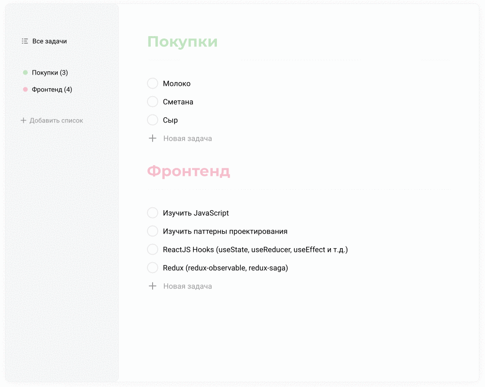

# ToDo

## Менеджер задач с разными списками дел
### Реализованые возможности:
* Добавление/ удаление списков дел/ добавление цветного маркера 
* Редактирование имени списка
* Добавление/удаление/редактирование задач
* Отметка выполненых задач
* Хранение информации на БД

### Запуск
* Скачать проект на пк
* Подтянуть зависимости командой `npm i` или `yarn`
* Запустить backend командой `npm server` или `yarn server`
* Запустить front командой `npm start` или `yarn start`
